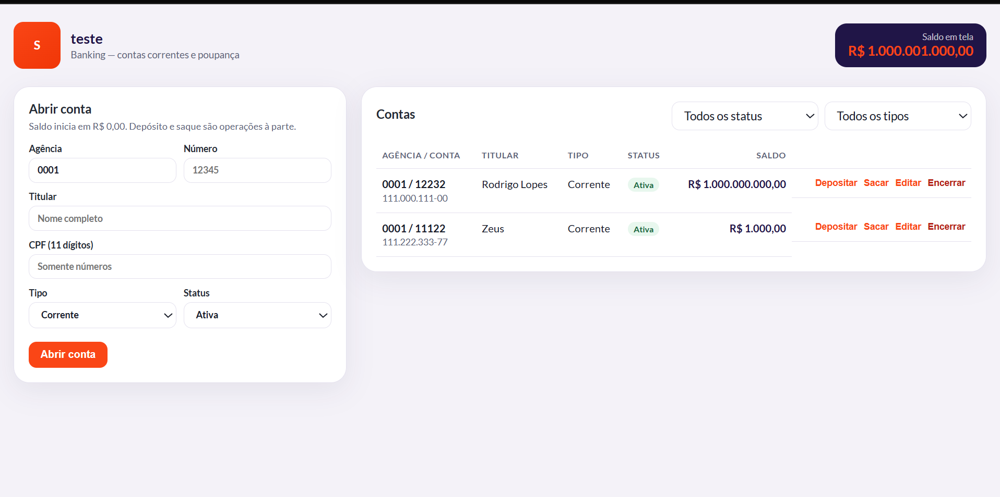

# Bank SRS — cadastro de contas

CRUD simples de **contas bancárias** (agência, número, titular, CPF, tipo, status e saldo) para treino em contexto financeiro.




Saldo **não** é editado no cadastro: começa em `0` e muda só com **depósito** e **saque**.

| Camada | Stack |
| ------ | ----- |
| Backend | Java 8, Spring Boot 2.7, Oracle, JPA, Swagger, testes unitários |
| Frontend | Angular 17, HTML, CSS |
| Qualidade | SOLID, JaCoCo, SonarQube |
| Infra | Docker + Docker Compose |

---

## Cenário (banco)

Uma agência digital mantém contas **corrente** e **poupança**.

| Campo Oracle (`CONTAS`) | Significado |
| ----------------------- | ----------- |
| `AGENCIA` + `NUMERO` | Identificação única da conta (constraint unique) |
| `TITULAR`, `CPF` | Cliente (CPF com 11 dígitos) |
| `TIPO` | `CORRENTE` ou `POUPANCA` |
| `STATUS` | `ATIVA`, `BLOQUEADA`, `ENCERRADA` |
| `SALDO` | `NUMBER(15,2)` — `BigDecimal` no Java |
| `SEQ_CONTA` | Sequence Oracle do ID |

Outras tabelas: `IDEMPOTENCIA` (chave única do pedido) e `FILA_MOVIMENTO` (fila de depósito/saque). Detalhe em **[cenarios-banco.md](./cenarios-banco.md)**.

### Regras de negócio (API)

| Caso | Comportamento |
| ---- | ------------- |
| Abrir conta | Saldo inicia em **0**. Recusa agência+número duplicados → **400** |
| Depositar / sacar | Só conta **ATIVA**. Valor > 0 |
| Sacar | Recusa se saldo < valor → **400** `Saldo insuficiente` |
| Conta bloqueada/encerrada | Depósito e saque recusados → **400** |
| Encerrar (DELETE) | Só com **saldo zero**. Senão → **400** |
| Conta inexistente | **404** |
| Validação (CPF, agência, valor) | **400** com mapa de campos |
| Idempotência | Header `Idempotency-Key`: mesma chave não aplica o movimento de novo |
| Race (saldo) | Depósito/saque usam `SELECT FOR UPDATE` na conta |
| Fila | `FILA_MOVIMENTO` no Oracle; worker a cada 3s ou `POST /api/fila/processar` |

Saldo usa `BigDecimal` (nunca `double` para dinheiro).

---

## Estrutura

```
crudJava/
├── backend/          # API Spring Boot
├── frontend/         # SPA Angular (layout agência)
├── docker-compose.yml
├── README.md
├── INTRO.md
├── STACKS.md
├── cenarios-banco.md
└── PERGUNTAS_ENTREVISTA.md
```

Camadas SOLID: `controller` → `ContaService` → `ContaRepository` → entidade `Conta` / DTOs.

---

## API REST

Base: `http://localhost:8080/api/contas`

| Método | Endpoint | Descrição |
| ------ | -------- | --------- |
| POST | `/api/contas` | Abrir conta |
| GET | `/api/contas` | Listar (`?status=ATIVA` ou `?tipo=CORRENTE`) |
| GET | `/api/contas/{id}` | Buscar |
| PUT | `/api/contas/{id}` | Atualizar cadastro (não mexe no saldo) |
| DELETE | `/api/contas/{id}` | Encerrar (saldo zero) |
| POST | `/api/contas/{id}/depositar` | `{ "valor": 100.00 }` + header opcional `Idempotency-Key` |
| POST | `/api/contas/{id}/sacar` | `{ "valor": 50.00 }` + header opcional `Idempotency-Key` |
| POST | `/api/contas/{id}/depositar-fila` | Enfileira depósito (`202`) |
| POST | `/api/contas/{id}/sacar-fila` | Enfileira saque (`202`) |
| POST | `/api/fila/processar` | Processa 1 item PENDENTE (lock na fila) |

### Body de cadastro

```json
{
  "agencia": "0001",
  "numero": "12345",
  "titular": "Maria Silva",
  "cpf": "12345678901",
  "tipo": "CORRENTE",
  "status": "ATIVA"
}
```

### Swagger

- http://localhost:8080/swagger-ui.html
- OpenAPI: http://localhost:8080/api-docs
- Via Docker/Nginx: http://localhost:4200/swagger-ui.html

---

## Subir com Docker

```bash
docker compose up --build
```

Aguarde o Oracle ficar healthy (1–2 min na primeira vez).

| Serviço | URL |
| ------- | --- |
| Frontend | http://localhost:4200 |
| Swagger | http://localhost:8080/swagger-ui.html |
| Oracle | `localhost:1521` / service `XEPDB1` |

Usuário Oracle da app: `tarefas` / `tarefas`

```bash
docker compose down
```

---

## Local (sem Docker da app)

```bash
docker compose up oracle -d
cd backend && mvn spring-boot:run
cd frontend && pnpm install && pnpm start
```

Testes: `mvn test` (relatório JaCoCo em `backend/target/site/jacoco/index.html`).

---

## SonarQube local (Windows)

A **aplicação continua Java 8**. Só o *scanner* do Sonar precisa de **JDK 11**.

### 1. Subir o servidor

```powershell
docker run -d --name sonarqube -p 9000:9000 sonarqube:9.9-community
```

Espere 1–2 min. Abra http://localhost:9000

- Primeiro login: `admin` / `admin`
- O Sonar pede **trocar a senha** (ex.: `admin123`)

### 2. JDK 11 só nesta sessão (PowerShell)

```powershell
winget install --id EclipseAdoptium.Temurin.11.JDK -e
```

Feche e abra o terminal. Depois:

```powershell
$env:JAVA_HOME = (Get-ChildItem "C:\Program Files\Eclipse Adoptium" -Directory | Where-Object { $_.Name -like "jdk-11*" } | Select-Object -First 1).FullName
$env:Path = "$env:JAVA_HOME\bin;" + $env:Path
java -version
```

Tem que aparecer **11**.

### 3. Analisar o backend

Na pasta `backend` (gera testes + JaCoCo e envia ao Sonar):

```powershell
cd C:\Users\rodrigo.junior\Desktop\projetos\crudJava\backend
mvn test
mvn sonar:sonar "-Dsonar.host.url=http://localhost:9000" "-Dsonar.login=admin" "-Dsonar.password=admin123"
```

Troque `admin123` se a senha do Sonar for outra.

Dashboard: http://localhost:9000/dashboard?id=com.entrevista%3Acrud-banco

### Config no projeto

**`backend/pom.xml`**

- `java.version` = `1.8` (compile da app)
- plugin JaCoCo `0.8.11` (cobertura em `target/site/jacoco/jacoco.xml`)
- plugin `org.sonarsource.scanner.maven:sonar-maven-plugin:3.11.0.3922`

**`backend/sonar-project.properties`**

```properties
sonar.projectKey=com.entrevista:crud-banco
sonar.projectName=crud-banco
sonar.projectVersion=1.0.0
sonar.sources=src/main/java
sonar.tests=src/test/java
sonar.java.binaries=target/classes
sonar.java.test.binaries=target/test-classes
sonar.coverage.jacoco.xmlReportPaths=target/site/jacoco/jacoco.xml
sonar.sourceEncoding=UTF-8
sonar.java.source=1.8
```

Com `mvn sonar:sonar` a chave efetiva é o GAV Maven: **`com.entrevista:crud-banco`**.

Quality Gate **Failed** com Bugs/Smells em A: revise **Security Hotspots** na UI (Safe/Fixed). O scan em si pode ter dado `BUILD SUCCESS` mesmo com o gate vermelho.

---

## Curl

```bash
# Abrir
curl -X POST http://localhost:8080/api/contas \
  -H "Content-Type: application/json" \
  -d "{\"agencia\":\"0001\",\"numero\":\"12345\",\"titular\":\"Maria Silva\",\"cpf\":\"12345678901\",\"tipo\":\"CORRENTE\",\"status\":\"ATIVA\"}"

# Depositar (idempotente: repetir a mesma chave não soma de novo)
curl -X POST http://localhost:8080/api/contas/1/depositar \
  -H "Content-Type: application/json" \
  -H "Idempotency-Key: pix-abc-1" \
  -d "{\"valor\":100.00}"

# Sacar
curl -X POST http://localhost:8080/api/contas/1/sacar \
  -H "Content-Type: application/json" \
  -d "{\"valor\":30.00}"

# Listar
curl http://localhost:8080/api/contas
```
